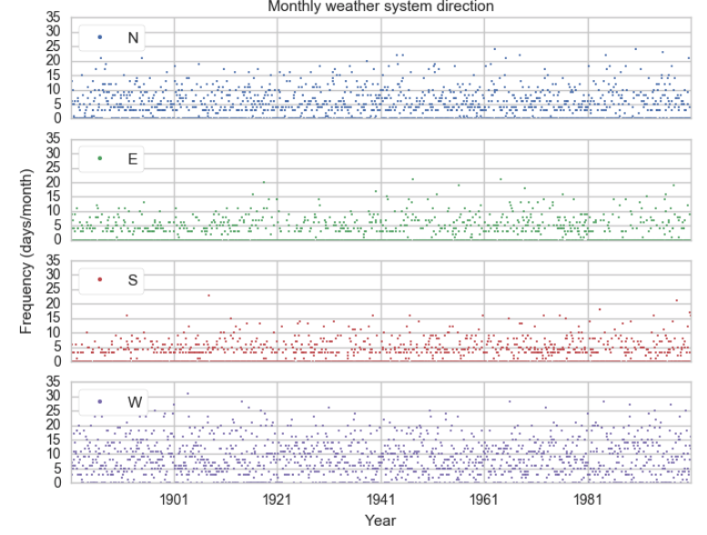
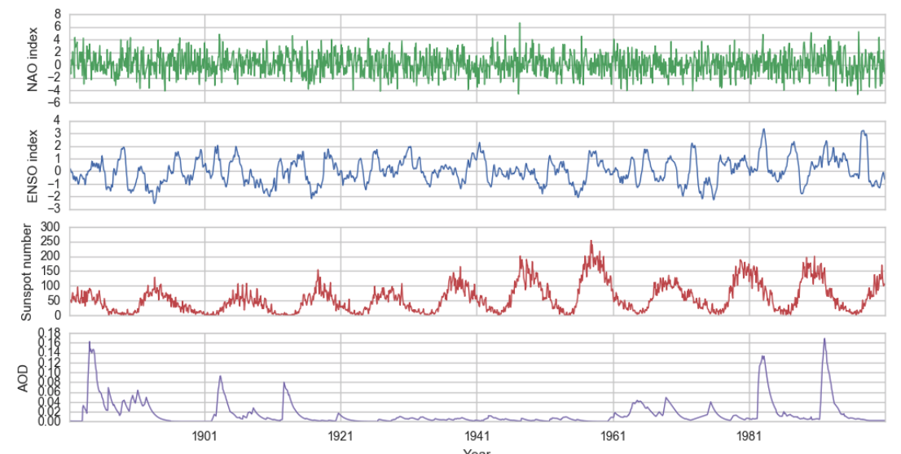

# Are there statistical links between the direction of European weather systems and ENSO, the solar cycle or stratospheric aerosols? #

[](https://opensource.org/licenses/mit-license.php) [](https://github.com/ellerbrock/open-source-badges/)

Repo relating to a study of European synoptic weather types published in the [Royal Society Journal Open Science](http://rsos.royalsocietypublishing.org/content/3/2/150320). Published 17 February 2016, DOI: 10.1098/rsos.150320.

We investigate the origin of weather systems and their relationship to the NAO, ENSO, Sato aerosol index, and the Solar cycle.

The repo contains a folder holding the data, another for figure outputs, and in the root directory a function file (.py) and IPython notebook (.ipynb). To run the analysis execute the notebook. The code is written in Python 3.

<iframe src="http://wl.figshare.com/articles/1471639/embed?show_title=1" width="568" height="116" frameborder="0"></iframe>


### Abstract ###

The Hess Brezowsky Großwetterlagen (HBGWL) European weather classification system, accumulated over a long period (more than 130 years), provides a rare opportunity to examine the impact of various factors on regional atmospheric flow. We have used these data to examine changes in the frequency (days/month) of given weather systems direction (WSD) during peak phases in the North Atlantic Oscillation (NAO), El Niño Southern Oscillation (ENSO), solar cycle (SC) and peaks in stratospheric aerosol optical depth (AOD) with superposed epoch analysis and Monte Carlo significance testing. We found highly significant responses to the NAO consistent with expectations: this signal confirmed the utility of the HBGWL data for this type of analysis and provided a benchmark of a clear response. WSD changes associated with ENSO, SC and AOD were generally within the ranges expected from random samples. When seasonal restrictions were added the results were similar, however, we found one clearly significant result: an increase in southerly flow of 2.6±0.8 days/month (p=1.9×10−4) during boreal summertime in association with El Niño. This result supports the existence of a robust teleconnection between the ENSO and European weather.


### Data Sources ###

Hess Brezowsky Großwetterlagen weather types, a subjective classification of synoptic-scale weather using meteorological sites across Germany, originally from [Hess, Paul and Brezowsky, Helmuth, Großwetterlagen Europas 1881-1992. 4., vollständig neu bearbeitete Auflage, Ber. Dt. Wetterd. 113, 1993, 5](http://www.dwd.de/bvbw/generator/DWDWWW/Content/Oeffentlichkeit/KU/KUPK/Schulen/Klima/Begriffe/Gro_C3_9Fwetterlagen__Katalog,templateId=raw,property=publicationFile.pdf/Gro&#223;wetterlagen_Katalog.pdf).



Sunspot data from the [World Data Center SILSO](http://sidc.be/silso/home), Royal Observatory of Belgium, Brussels.

Stratospheric aerosol data from [NASA](http://data.giss.nasa.gov/modelforce/strataer).

MEI (ENSO) data from [NOAA](http://www.esrl.noaa.gov/psd/enso/mei.ext/), credit Dr Klaus Wolter.

NAO data from [CRU](http://www.cru.uea.ac.uk/timo/datapages/naoi.htm/).



### Reproducibility Notes ###

A `Makefile` is provided to create a [Conda environment](https://conda.io/docs/user-guide/tasks/manage-environments.html) with all the library versions used to execute this code.

You should first create the environment with

```
make env
```

and then you can run the code with

```
source activate ewind
make
```

You can type

```
make help
```

for further details on the Makefile.  The main [Notebook](HBGWL_analysis.ipynb) has additional notes on reproducibility issues that arise with particular parts of the code.

A `requirements.txt` file is also provided if you prefer to use pip/virtualenv. If you follow this route, you should use it with a Python 3.4 environment, to match how the original paper was created (conda environment files can specify the Python version itself, so there's no need for this manual caveat if you follow the conda route).

## License

Copyright 2016, Benjamin A. Laken

Permission is hereby granted, free of charge, to any person obtaining a copy of this software and associated documentation files (the "Software"), to deal in the Software without restriction, including without limitation the rights to use, copy, modify, merge, publish, distribute, sublicense, and/or sell copies of the Software, and to permit persons to whom the Software is furnished to do so, subject to the following conditions:

The above copyright notice and this permission notice shall be included in all copies or substantial portions of the Software.

THE SOFTWARE IS PROVIDED "AS IS", WITHOUT WARRANTY OF ANY KIND, EXPRESS OR IMPLIED, INCLUDING BUT NOT LIMITED TO THE WARRANTIES OF MERCHANTABILITY, FITNESS FOR A PARTICULAR PURPOSE AND NONINFRINGEMENT. IN NO EVENT SHALL THE AUTHORS OR COPYRIGHT HOLDERS BE LIABLE FOR ANY CLAIM, DAMAGES OR OTHER LIABILITY, WHETHER IN AN ACTION OF CONTRACT, TORT OR OTHERWISE, ARISING FROM, OUT OF OR IN CONNECTION WITH THE SOFTWARE OR THE USE OR OTHER DEALINGS IN THE SOFTWARE.
